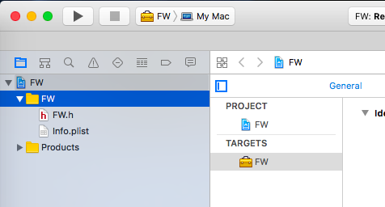
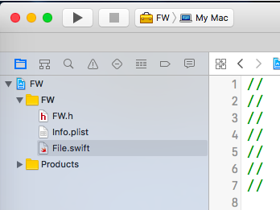
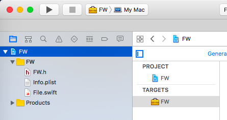
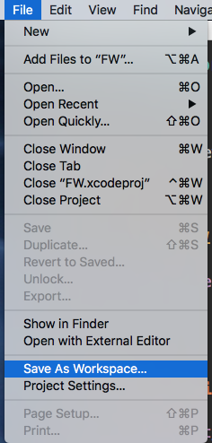
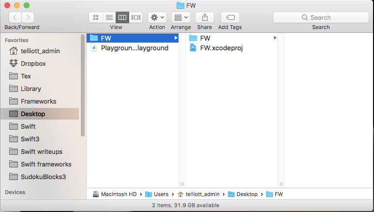
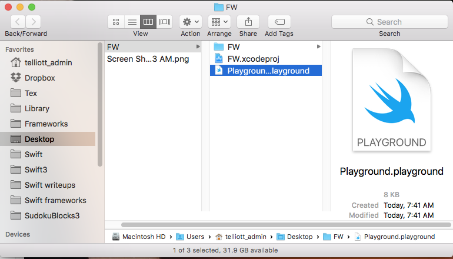
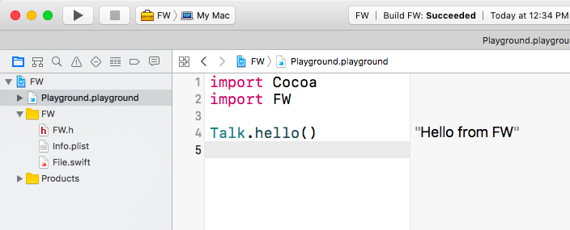
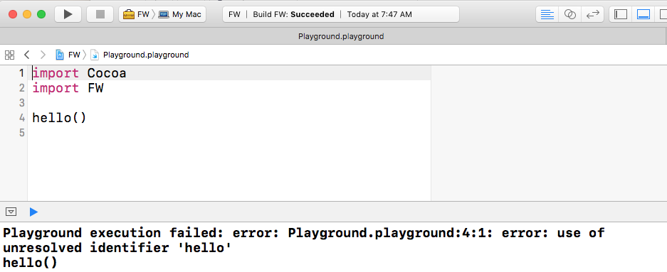
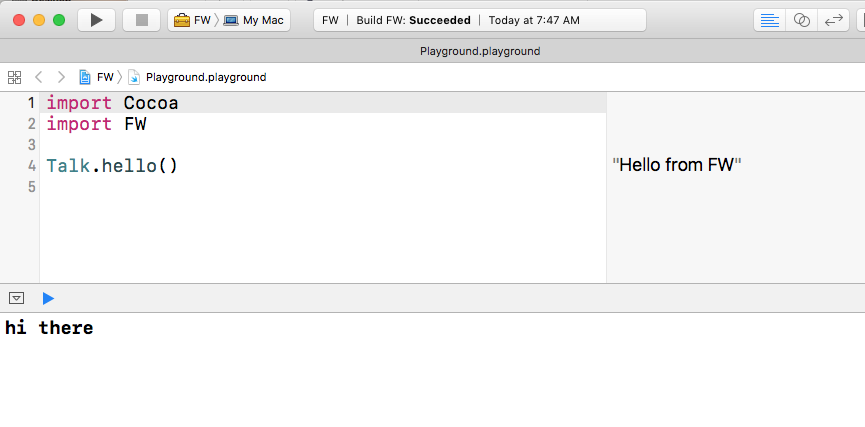
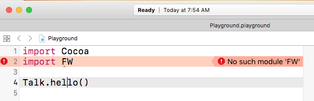

## Add a Framework to a Playground

Start by creating a new project in Xcode:

* OS X Cocoa Framework
* Swift
* name: **FW**

Select the FW *folder*



New > File > New

* Swift file
* name: **File.swift**



```css
public class Talk {
    public class func hello() -> String {
        print("hi there")
        return "Hello from FW"
    }
}
```

I couldn't get **print** to work into the Playground output, but returning a value is more useful, anway.

* Build the project

With the project selected, 



Do 

* save as File > Workspace

 

* name:  **FW.xcworkspace**

Create a new Playground

Save it inside the project folder next to the Swift files.  We do the save here:



You must still add the Playground to the project.  Click on the *project* tab and do File > AddFiles and navigate to the Playground file.


 
Build the FW project again.

In the playground:



```css
import FW
Talk.hello()
```

[ ``hello`` by itself won't work.]
<<<<<<< HEAD



It works!  The ``print`` statement  in the Framework shows up in the Debug area.  ``



If you have issues make sure that in your
Xcode Preferences:  Locations > Advanced > configuration is 'Unique'.

Note:  you must have the Xcode project open and click on the playground in the project navigator.  You can't just open the Playground from the Finder, like here:


If you do that you'll get the dreaded:

=======


It works!  The ``print`` statement  in the Framework shows up in the Debug area.  ``


If you have issues make sure that in your
Xcode Preferences:  Locations > Advanced > configuration is 'Unique'.

Note:  you must have the Xcode project open and click on the playground in the project navigator.  You can't just open the Playground from the Finder, like here:


If you do that you'll get the dreaded:

>>>>>>> finishing up
