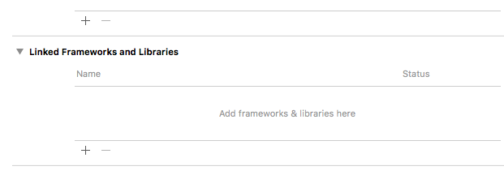
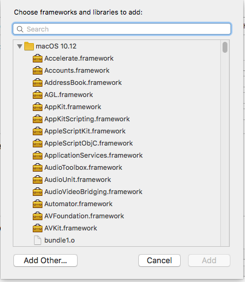
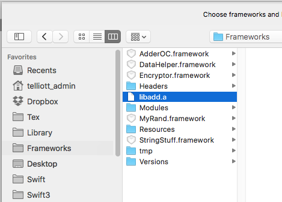
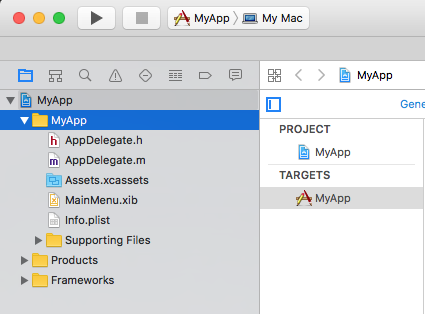

#### Method 5:  Objective-C app

* Now, make a new Xcode project, a Cocoa app called **UseStaticLib** on the Desktop, choose **Objective-C** for the language. 

Link the library to the project by clicking + on Linked Frameworks and Libraries, with the project selected in the project navigator.



Add other



Navigate to ```~/Library/Frameworks/libadd.a``` and select it.



* Add the header file ``add.h`` to the new Cocoa project.  One good way to do this is to first copy the file into the project directory that contains source files, and then add it by using AddFiles..  Be sure the folder and not the project is selected in the sidebar.

 

* In the AppDelegate (either ``AppDelegate.h`` or ``AppDelegate.m``) do 

```c
#import "add.h"
```

In **applicationDidFinishLaunching** call the functions, e.g. here ``f1``

```c
int x = f1(1);
printf("AD: %d;", x);
```

Build and run.  The debug panel will log

```bash
f1: 1; AD: 2;
```

It works!