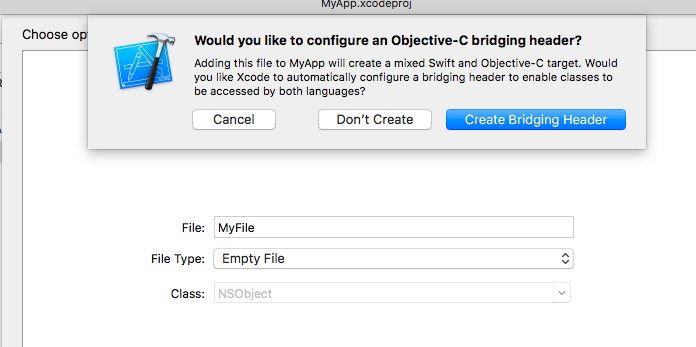

#### Objective-C framework from a Swift Cocoa app.

The basics: start a new Xcode project in Swift and call it MyApp. 

We need a "bridging header", we get this by adding a new Objective C file, then Xcode will ask if we want this header, and we say yes. 



Ungratefully, we promptly delete the dummy Objective C class. In the bridging header, add:

```css
#import "AdderOC/AdderOC.h"
```

You also need to link to the framework, by adding it to Linked Libraries and Frameworks, as we did before.

Finally, this to **ApplicationDidFinishLaunching**

```css
let x = f1(1)
print("\nAD;  x:\(x)")
```

Build and run and  it will log

```css
f1: 1;
AD;  x:2
```

We even get the ``printf`` from C!
