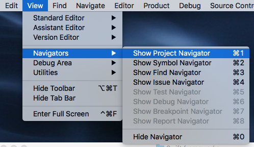
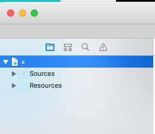

### Playground

I followed the instructions [here](http://help.apple.com/xcode/mac/8.0/#/devfa5bea3af) to copy the file **StringStuff.swift** to the Sources folder of a Playground project.

Make a new Playground.  Open the project navigator 


It looks like this


Click the plus at the bottom to Add Files


Import of the code as a module happens automatically, there is no need for an import statment.  

Note that the symbols to be accessed must be marked ``public``.

**stringStuff.swift**

```swift
import Foundation

extension String {
    public func stripCharacters(input: String) -> String {
        let badChars = input.characters
        let ret = self.characters.filter {
            !badChars.contains($0) }
        return String(ret)
    }
}

```
In the Playground:

```swift
let s = "a$b#c."
s.stripCharacters(input: "$X.")
```

