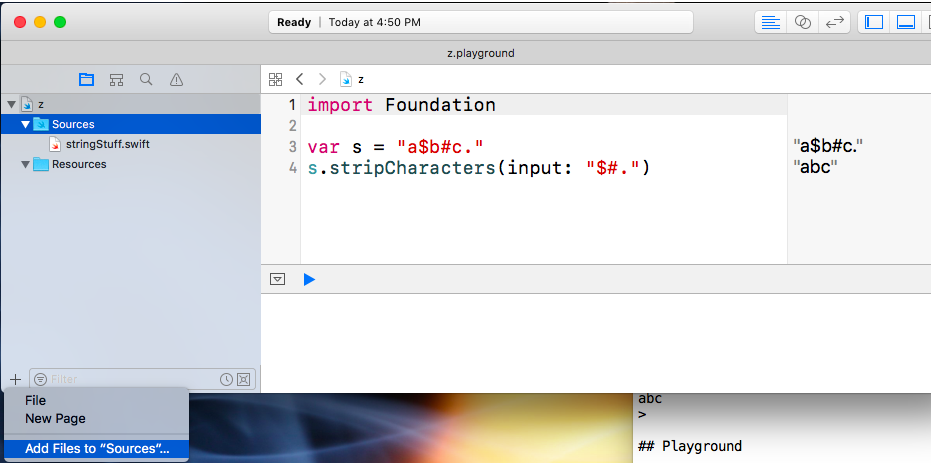

### Playground

I followed the instructions [here](http://help.apple.com/xcode/mac/8.0/#/devfa5bea3af) to copy the file **StringStuff.swift** to the Sources folder of a Playground project.

Import of the code as a module happens automatically, there is no need for an import statment.  An important difference from the first method is that the symbols to be accessed must be marked ``public``.
