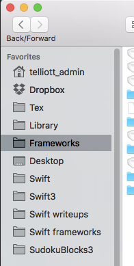
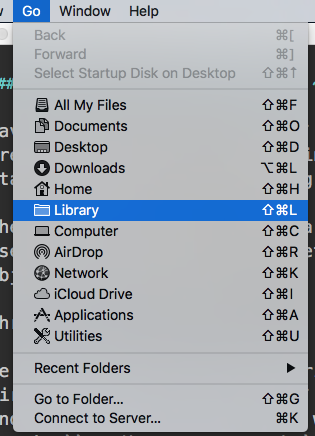
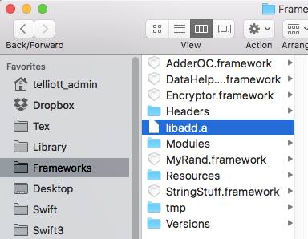

#### Method 4:  Static library from ~/Library/Frameworks

Having made a static library ``libadd.a`` in the previous step, we now try moving it to a standard directory for putting this stuff.

The eventual goal is to make a Cocoa app that uses ``f1`` and ``f2`` ... whether written in Objective C or in Swift.  

<hr>

We are going to put our libraries into a directory called ``Frameworks``, where libraries and frameworks should go.  We will use the user's ``~/Library/Frameworks`` rather than the system-wide ``/Library/Frameworks`` (not to be confused with ``/System/Library/Frameworks``.

[Apple has different advice, but we are hobbyists, and I think this is a better choice].

It can make things easier to have this directory in the navigation thingie in the Finder window.



It's not shown under the **Go** menu by default.

But appears if you do Shift-Command.



So you can drag it over to the sidebar.

Now, follow these four steps.

* First, copy ``libadd.a`` into ``~/Library/Frameworks``.  From the command line you could do:

```bash
> cp libadd.a ~/Library/Frameworks
> ls ~/Library/Frameworks/l*
/Users/telliott_admin/Library/Frameworks/libadd.a
>
```
or you can just use what we set up in the Finder a second ago.



Now, we try it from the command real quick:

```bash
> clang -g -Wall -o useadd useadd.c -L/Users/telliott_admin/Library/Frameworks -ladd
> 
```
I don't have to tell you to substitute your username, right?

```bash
> ./useadd
f1: 1;   main 2
f2: 10;   main 12
>
```
Seems to work!